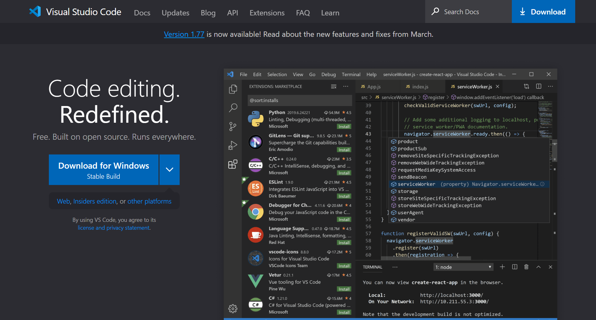
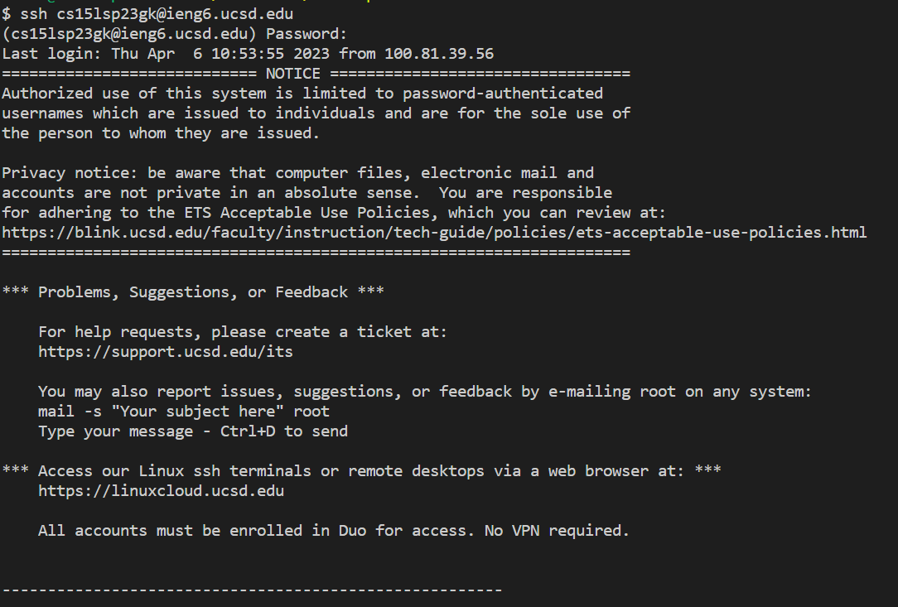
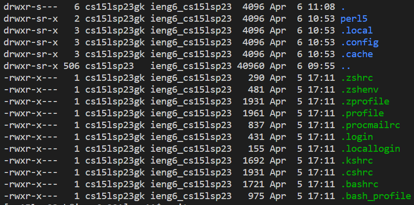

# CSE15L: How to log into course account
*Knowing how to log into your account is very useful for this course*

## Resetting password
[Start by looking up your 15L account](https://sdacs.ucsd.edu/~icc/index.php)
* You will have to first reset a new password for the CSE15L account
[Follow these instructions](https://drive.google.com/file/d/17IDZn8Qq7Q0RkYMxdiIR0o6HJ3B5YqSW/view)
* Ask a friend next to you or an instuctor for support if you are having trouble resetting the password

## Signing in 
>Once you have reset the password, open VSCode or download it if you have not done so already
[VSCode Download](https://code.visualstudio.com/)

>If you are using a Windows device, make sure to download GitBash
>[GitBash download](https://git-scm.com/download/win)
*Logging in using VSCode and running commands:*
* Open up a terminal in VSCode. 
* Type in *ssh* and then type in your CSE15L account email and hit enter
* Type in your password
>Once the login is successful you will be prompted with a large chunk of text and numbers in the terminal like this: 

## Trying commands

> Go ahead and try running some commands in the terminal
* Experiment with different commands and see what is returned! Here are some to get you started `pwd`  `cd`  `ls` `lat` 
* Once you are done, you can exit remote access by simply typing *exit* into the terminal 
